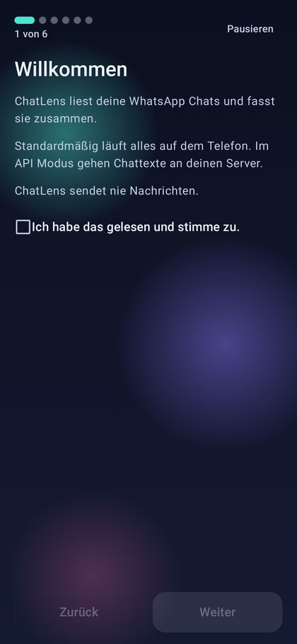
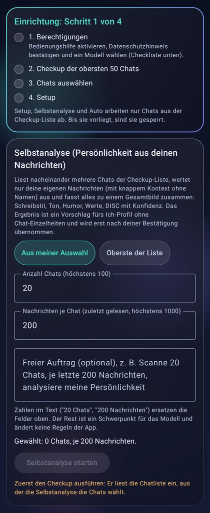
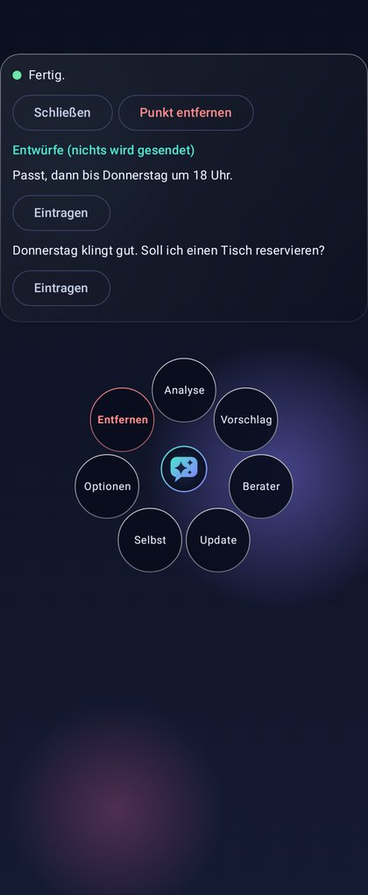
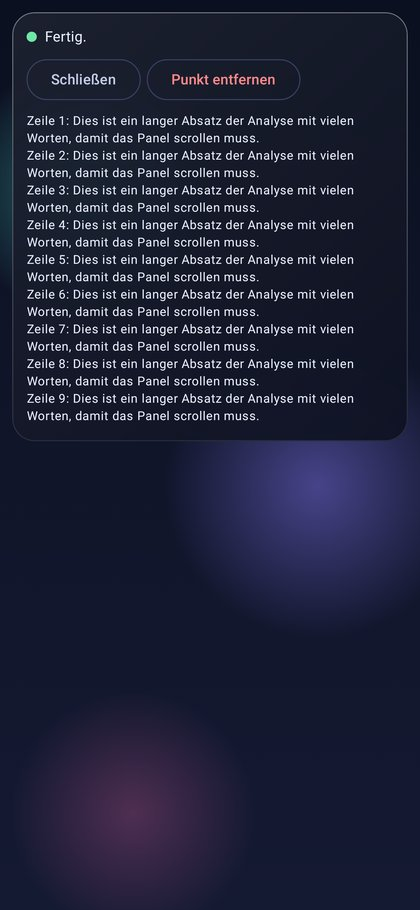
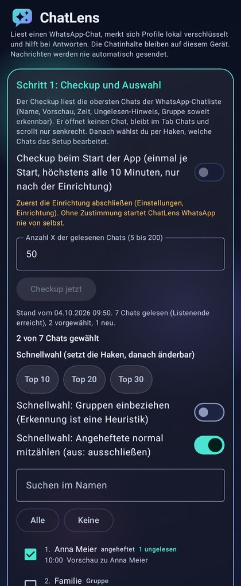
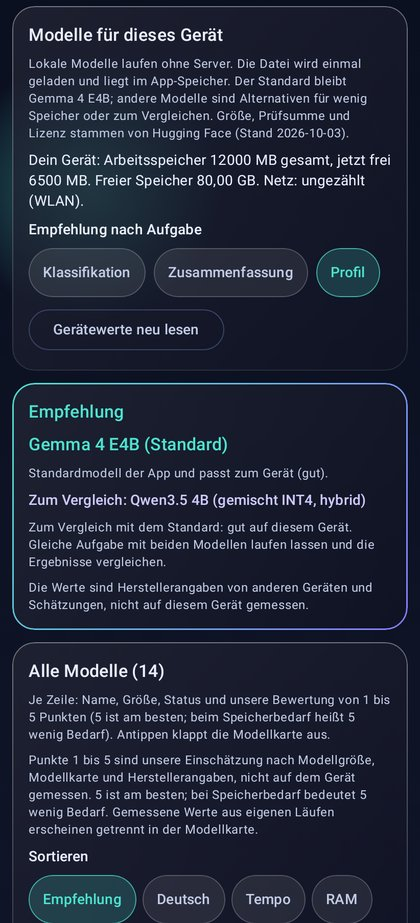
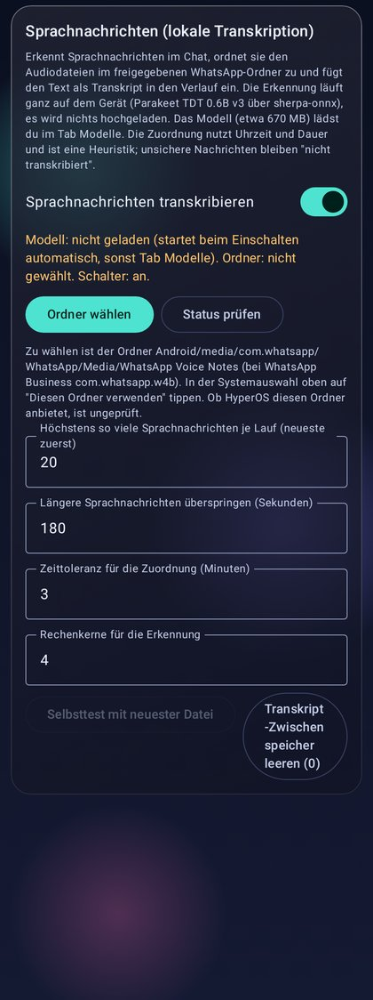

# ChatLens

ChatLens ist eine Android-App, die einen geöffneten WhatsApp-Chat über die Bedienungshilfe (AccessibilityService) liest, den Verlauf zurückscrollt und ihn von einem Sprachmodell auswerten lässt. Das Modell läuft standardmäßig lokal auf dem Telefon (Gemma 4 über LiteRT-LM). ChatLens sendet nie selbst Nachrichten. Antwortvorschläge landen höchstens als Entwurf im Eingabefeld, den Senden-Knopf drückst immer du.

> Status: MVP (Version 0.3.0). Gebaut und mit Unit-Tests sowie Emulator-Läufen geprüft. Auf echten Geräten nur teilweise getestet. WhatsApp ändert seine Oberfläche regelmäßig, die Selektor-Profile müssen dann nachgezogen werden.

<p align="center">
  
  
  
  
</p>

## Funktionen

* **Schwebender Punkt**: Ein kleiner Punkt liegt über WhatsApp. Tippen öffnet einen Ring mit Aktionen wie Analyse, Vorschlag, Bester, Selbst, Update, Optionen und Entfernen. Das Ergebnis erscheint in einem Panel direkt über dem Chat.
* **Chat lesen**: Der Chat wird über den Accessibility-Baum gelesen, mehrfach rückwärts gescrollt und zu einem sauberen Verlauf zusammengesetzt (Absender, Zeit, Text, eigene oder fremde Nachricht).
* **Analyse und Antwortvorschläge**: Der Verlauf geht mit einer Anweisung an das Modell. Die Antwort kann auf Wunsch als Entwurf ins Eingabefeld eingetragen werden.
* **Lokale Modelle**: Modellkatalog mit Gemma 4 E2B und E4B sowie Qwen3 und Qwen3.5 als LiteRT-LM-Dateien. Download mit Fortschritt, Pause, Fortsetzen und SHA-256-Prüfung, Empfehlung passend zum Arbeitsspeicher des Geräts.
* **Sprachnachrichten**: Optional lokale Umschrift mit NVIDIA Parakeet TDT 0.6B v3 über sherpa-onnx. Die Audiodateien kommen aus einem Ordner, den du selbst freigibst.
* **Texterkennung in Bildern**: Offline über ML Kit.
* **Checkup und Auswahl**: Liest die obersten Chats der Chatliste, ohne einen Chat zu öffnen, und lässt dich auswählen, welche Chats bearbeitet werden.
* **Gedächtnis**: Steckbrief je Chat, vorsichtige DISC-Einschätzung des Gegenübers und ein Ich-Profil mit deinem eigenen Schreibstil. Alles verschlüsselt auf dem Gerät.
* **Einrichtungsassistent**: Führt durch Bedienungshilfe, Overlay-Erlaubnis, Modellwahl und den ersten Checkup.

<p align="center">
  
  
  
</p>

## Aufbau

```
app/                      Android-App (Kotlin, Jetpack Compose)
  src/main/kotlin/app/chatlens/
    service/              ChatAccessibilityService (liest den Bildschirm), OverlayService (schwebender Punkt), Vordergrunddienst
    assist/               ReplyActions (Entwurf ins Eingabefeld schreiben), Transkription, Assistenzaktionen
    profile/              SelectorProfile (Ansichts-IDs je Messenger)
    parse/                Parser für Chatliste und Verlauf, Zusammenführen der Scrollseiten
    llm/                  LiteRT-LM-Backend, OpenAI-kompatibles Backend, Prompt- und Kontextaufbau
    models/               Modellkatalog, Downloader, Speicherprüfung
    asr/                  Sprachnachrichten (Ogg/Opus, Parakeet über sherpa-onnx)
    memory/               Gedächtnis, Steckbriefe, DISC, Ich-Profil, Verschlüsselung
    vision/               Texterkennung und Bildwerkzeuge
    ui/                   Oberfläche, Assistent, Overlay-Panel
  src/main/assets/
    profiles/             Selektor-Profile für WhatsApp, Telegram, Signal
    model-catalog.json    Modellkatalog mit festen Revisionen und Prüfsummen
fakewa/                   WhatsApp-Attrappe mit synthetischen Testdaten für Emulator-Tests
tools/                    Emulator-Regression, Katalogprüfung, Logo-Werkzeuge
docs/                     Bilder, Änderungsverlauf, Entwurf der Datenschutzerklärung
```

Es gibt zwei Produktvarianten (Flavors):

* `full`: mit optionalem API-Modus (eigener OpenAI-kompatibler Server), für Entwicklung und direkte Weitergabe.
* `play`: ohne API-Modus, ohne unverschlüsseltes HTTP, für eine spätere Store-Fassung.

## Bauen

Voraussetzungen: JDK 17, Android SDK mit Plattform 36 und Build-Tools 36.0.0. Lege eine Datei `local.properties` mit `sdk.dir=/pfad/zum/android-sdk` an (sie wird nicht eingecheckt).

```bash
./gradlew :app:assembleFullDebug        # APK unter app/build/outputs/apk/full/debug/
./gradlew :app:assemblePlayDebug        # APK unter app/build/outputs/apk/play/debug/
./gradlew :app:testFullDebugUnitTest    # JVM-Tests auf synthetischen Bäumen
./gradlew :app:lintFullDebug
```

Die App ist auf arm64 beschränkt (ABI-Filter), weil LiteRT-LM, sherpa-onnx und ML Kit native Bibliotheken mitbringen. Modelle sind nicht im APK enthalten, sie werden in der App heruntergeladen.

## Installation per Sideload

1. APK aufs Telefon kopieren und öffnen. Die Installation aus unbekannten Quellen für den Dateimanager oder Browser erlauben.
2. ChatLens öffnen und dem Assistenten folgen.
3. Bedienungshilfe **ChatLens Chat-Leser** aktivieren (Einstellungen, Bedienungshilfen, Heruntergeladene Apps).
4. Für den schwebenden Punkt **Über anderen Apps einblenden** erlauben.
5. Im Tab Modelle ein Modell laden, am besten im WLAN.

### Hinweis für Xiaomi, HyperOS und MIUI

Bei per Sideload installierten Apps ist der Schalter für die Bedienungshilfe oft grau. Dann so freischalten:

1. Einstellungen, Apps, Apps verwalten, **ChatLens**.
2. Menü oben rechts (drei Punkte), **Eingeschränkte Einstellungen zulassen**.
3. Danach die Bedienungshilfe erneut einschalten.

Damit der schwebende Punkt zuverlässig bleibt, zusätzlich in den App-Einstellungen **Autostart** erlauben, den Akku auf **Keine Einschränkungen** stellen und **Pop-up-Fenster im Hintergrund anzeigen** zulassen.

## Datenschutz

* Chatinhalte werden nur gelesen, wenn du einen Auftrag auslöst.
* Mit lokalem Modell verlässt kein Chattext das Gerät.
* Gedächtnis, Auswahl und Einstellungen liegen im privaten App-Speicher, verschlüsselt mit AES-GCM, Schlüssel im Android Keystore. Cloud-Backup ist abgeschaltet.
* Keine Werbung, keine Analyse-SDKs, keine Weitergabe an Dritte.
* Nur in der `full`-Variante kannst du einen eigenen API-Server eintragen. Dann gehen Chattexte an diesen Server. Das ist eine Übermittlung personenbezogener Daten Dritter, für die du selbst verantwortlich bist.
* ChatLens drückt nie den Senden-Knopf.

Ein Entwurf der Datenschutzerklärung liegt unter [docs/DATENSCHUTZ.md](docs/DATENSCHUTZ.md).

**Wichtig:** Die Nutzungsbedingungen von WhatsApp untersagen automatisierten Zugriff. Eine Einschränkung oder Sperre des Kontos ist möglich. Nutzung auf eigenes Risiko und nur mit dem eigenen Konto. ChatLens steht in keiner Verbindung zu WhatsApp oder Meta.

## Projekte, die darauf aufbauen

* **[MemEm](https://github.com/slickdajackson/MemEm)**: Meme-Generator für den Chat. MemEm nutzt die Grundlage von ChatLens (schwebender Punkt, Accessibility-Zugriff auf WhatsApp, Eintragen ins Eingabefeld) und erzeugt aus deiner Nachricht passende Memes mit lokalen Modellen.

## Lizenz

Der eigene Code steht unter der [MIT-Lizenz](LICENSE). Bibliotheken und Modelle von Dritten behalten ihre Lizenzen, siehe [THIRD_PARTY_NOTICES.md](THIRD_PARTY_NOTICES.md). Der Änderungsverlauf der MVP-Versionen steht in [docs/CHANGELOG.md](docs/CHANGELOG.md).
